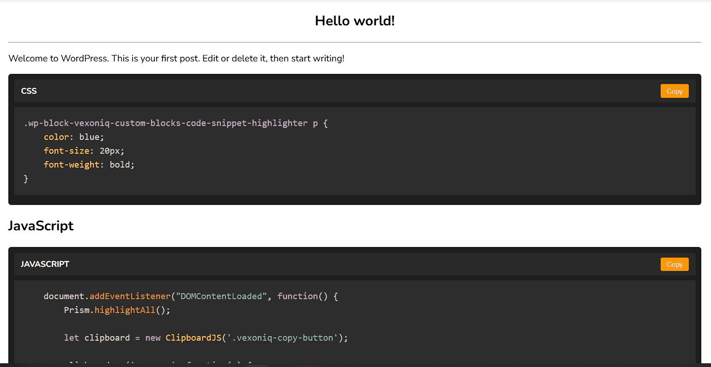

# vexoniq-custom-blocks

# Vexoniq Learning Hub - Custom Blocks

This repository contains custom WordPress blocks developed for the **Vexoniq Learning Hub**. These blocks are built using `@wordpress/create-block` and provide enhanced functionality and design flexibility within the Gutenberg editor.

## Dependencies
The custom blocks rely on the following dependencies:
- **WordPress Block Editor (Gutenberg)**
- **Prism.js** (for syntax highlighting)
- **Node.js** (for development purposes, if modifying the plugin)

## Installation
To install and use these custom blocks in your WordPress site, follow these steps:

1. Download the repository as a ZIP file.
2. Go to your WordPress Admin Panel.
3. Navigate to **Plugins > Add New > Upload Plugin**.
4. Upload the ZIP file and click **Install Now**.
5. Once installed, activate the plugin.

## Usage
1. Open the **WordPress Block Editor (Gutenberg).**
2. Click **Add Block** (`+` button).
3. Search for the **Vexoniq Custom Blocks**.
4. Select the desired block and customize as needed.

## Contact
For any issues or feature requests, please open an issue in the repository or contact us at [support@vexoniq.com](mailto:support@vexoniq.com).

